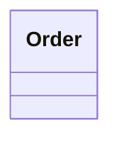

# 详细设计：同步格式与规则

## `uml.sync.md`

- **解析**：优先读取文件开头 **YAML front matter**（`---` 闭合），字段见 `02-physical/uml-vue-sdi/spec.md`。
- **正文**：人类可读规则（编号列表）：例如「类图变更 → 更新 `*.class.md` → 再改代码头文件」。
- **与 AI**：`.cursor/rules/uml-code-sync.mdc` 引用同一路径约定，便于仓库内助手遵守。

## `*.uml.md`

- 每个二级标题建议对应一张图；图体为：

````markdown
## 类图 · 订单域


````

## `*.class.md` / `*.code.md`

- **路径**：二者均位于 **`namespace_root`** 之下（同一命名空间目录树内）；**不**将 `*.code.md` 放入 `code_impls` 所指的真实代码根。
- **class**：每个类一节，`### ClassName`，表格列：成员、类型、说明。
- **code**：按 `## 文件名或逻辑分组` 分节， fenced 代码块带语言标签。

## 同步方向（约定）

1. **UML → 契约**：先对齐类图与 `*.class.md`。
2. **契约 → 代码**：再改 `*.h`/`*.cpp` 等（具体语言由项目决定，规则中不写死）。
