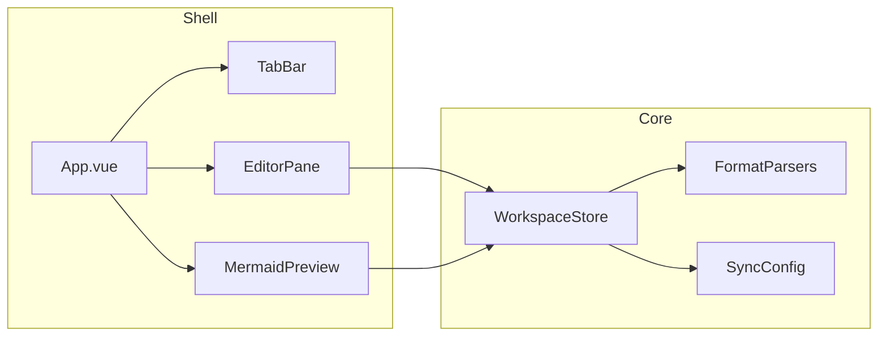

# 系统设计

## 模块边界

## 与 `02-physical/uml-vue-sdi` 对应

- UI 组件与 Store 映射见该目标 `mapping.md`（含 `App.vue` 壳、`SyncConfigEditor`、`MermaidPreview` / `ClassDiagramCanvas`、`ClassClassMdCanvas`、`CodeMdCanvas`、`TextContentDock`、`PropertiesDock` 等）。
- 字段级行为以 `spec.md` 为准。

## 一致性

- 变更文件格式时，必须同步 `00-concept/database-design.md` 与本目录详细设计、`02-physical` spec、示例与 Cursor 规则 `uml-code-sync.mdc`。
