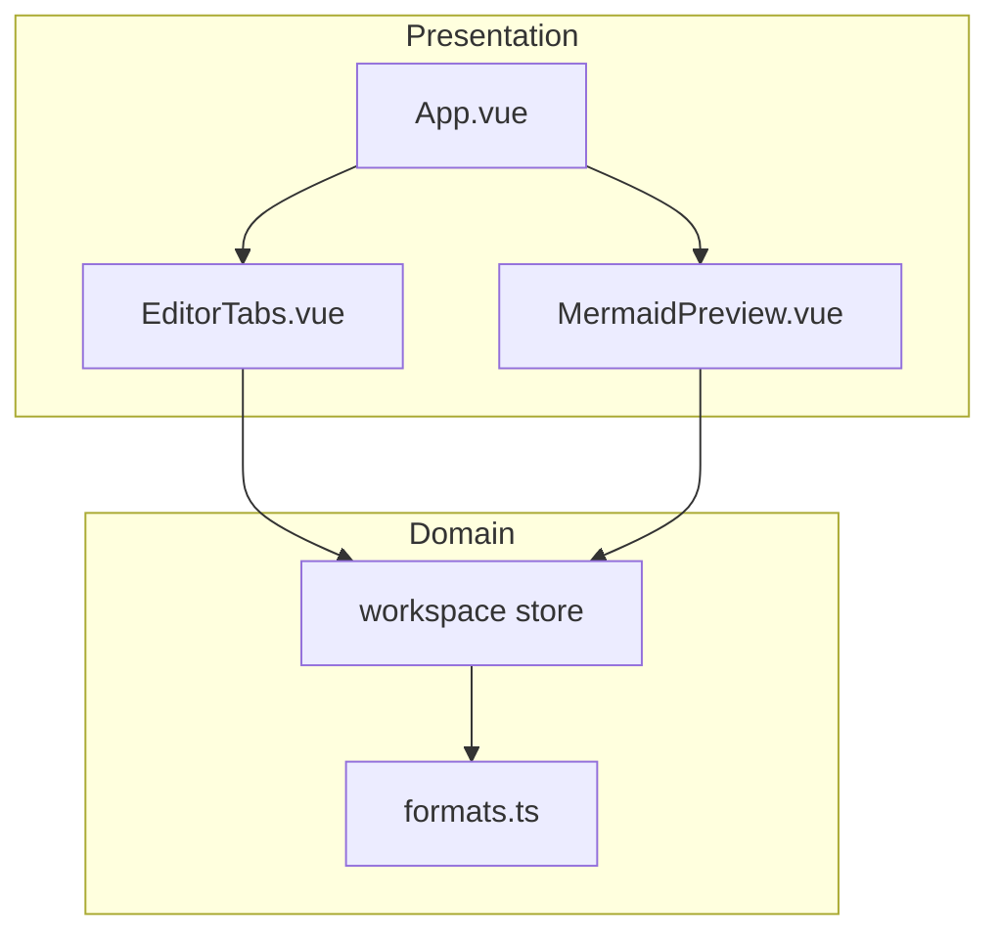

# 组件图（uml-vue-sdi）

```mermaid
flowchart TB
  subgraph presentation [Presentation]
    App[App.vue]
    EditorTabs[EditorTabs.vue]
    MermaidPreview[MermaidPreview.vue]
  end
  subgraph domain [Domain]
    WorkspaceStore[workspace store]
    Formats[formats.ts]
  end
  App --> EditorTabs
  App --> MermaidPreview
  EditorTabs --> WorkspaceStore
  MermaidPreview --> WorkspaceStore
  WorkspaceStore --> Formats
```
