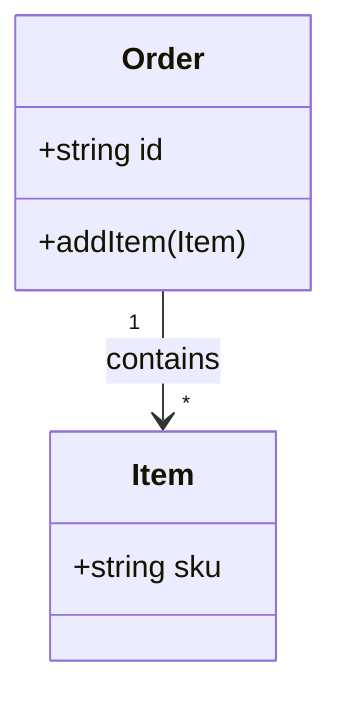
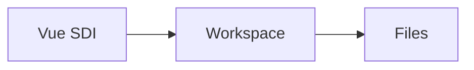

# 领域 UML

## 类图 · 核心

```mermaid
classDiagram
  class Order {
    +string id
    +addItem(Item)
  }
  class Item {
    +string sku
  }
  Order "1" --> "*" Item : contains
```

## 组件图 · 概览

```mermaid
flowchart LR
  UI[Vue SDI] --> Core[Workspace]
  Core --> FS[Files]
```
