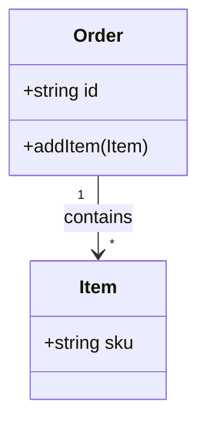

# 类图 · 订单域

> **约定**：每个 `*.uml.md` **只保存一张图**（通常一个 ```mermaid 块）。若需多张图，在 `uml_root` 目录下用**多个** `*.uml.md` 文件分别存放，而不是在同一文件里堆多张图。


```mermaid
classDiagram
  class Order {
    +string id
    +addItem(Item)
  }
  class Item {
    +string sku
  }
  Order "1" --> "*" Item : contains
```
