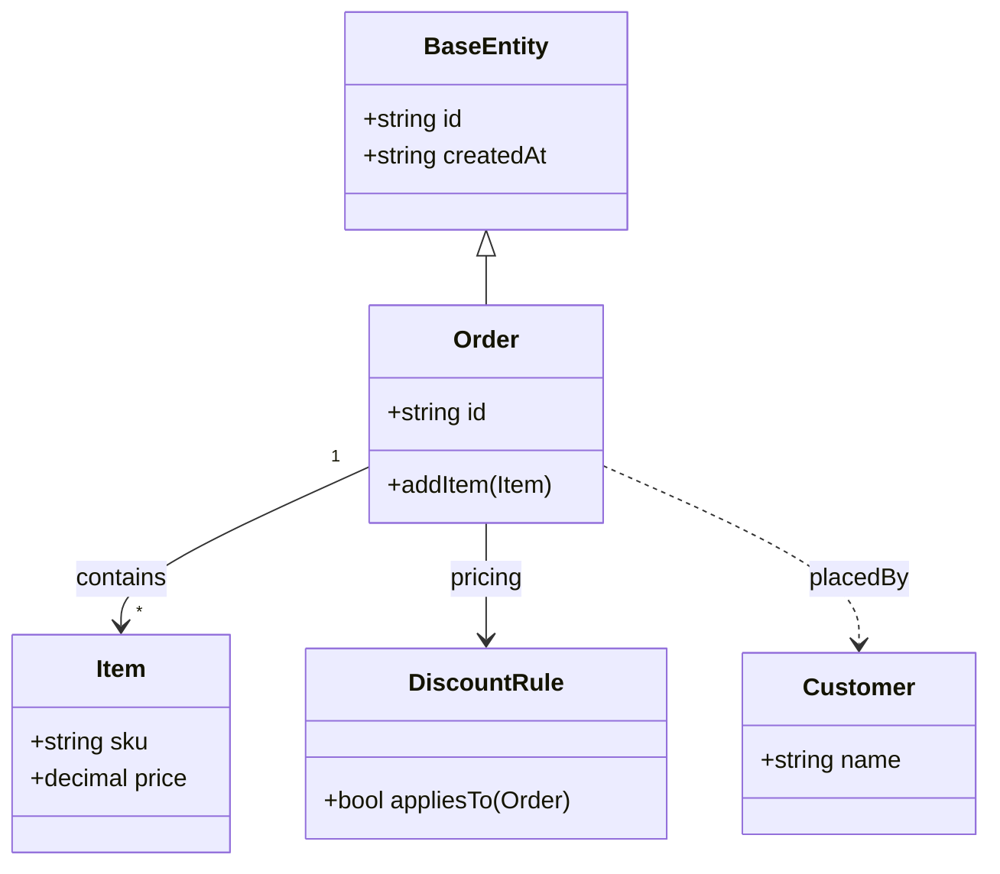

# 类图 · 订单域

> **约定**：每个 `*.uml.md` **只保存一张图**（通常一个 ```mermaid 块）。若需多张图，在 `uml_root` 目录下用**多个** `*.uml.md` 文件分别存放，而不是在同一文件里堆多张图。

本文件用于测试可编辑类图画布中的 **继承**（`<|--`）、**关联**（`-->`，含基数与标签）、**简单单向依赖**（`..>`，解析为与关联同类的连线语义）等关系的解析与绘制。



<!-- uml-class-diagram-layout:{"v":1,"positions":{"BaseEntity":{"x":200,"y":40},"Order":{"x":200,"y":280},"Item":{"x":520,"y":280},"DiscountRule":{"x":520,"y":40},"Customer":{"x":520,"y":520}},"folded":{},"edgeVisibility":{"inherit":true,"association":true}} -->
