# Mermaid 扩展示例：全部 `mermaid-*`（21 种）

本文件仅用于 Mermaid 扩展能力示例。核心契约示例请看 `models-core.md`。

统一规则见：[`PAYLOAD_RULES.md`](PAYLOAD_RULES.md)。

```mv-model-sql
{
  "id": "sql_demo",
  "title": "演示 SQL Model 组",
  "tables": [
    {
      "id": "person",
      "columns": [{ "name": "id" }],
      "rows": [{ "id": "p1" }]
    }
  ]
}
```

> 约定：
> - 每个 `mermaid-*` 示例均为一对 `` ```mv-view `` + `` ```mermaid ``。
> - 这类扩展语法属于“文本 payload”，因此 `payload` 保持字符串语义（此处用空串），由镜像段承载正文。
> - 与之对应，`models-core.md` 中的 JSON 型 payload（如 `uml-*`、`mindmap-ui`）直接写对象。

```mv-view
{"id":"mmd_architecture","kind":"mermaid-architecture","title":"mermaid-architecture","modelRefs":["sql_demo#person"],"payload":""}
```
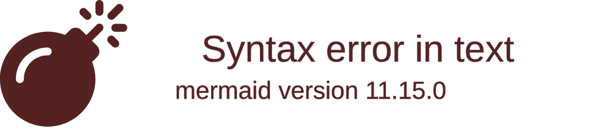

```mv-view
{"id":"mmd_block","kind":"mermaid-block","title":"mermaid-block","modelRefs":["sql_demo#person"],"payload":""}
```
```mermaid
block-beta
columns 1
  block:a["Block A"]
```

```mv-view
{"id":"mmd_c4","kind":"mermaid-c4","title":"mermaid-c4","modelRefs":["sql_demo#person"],"payload":""}
```
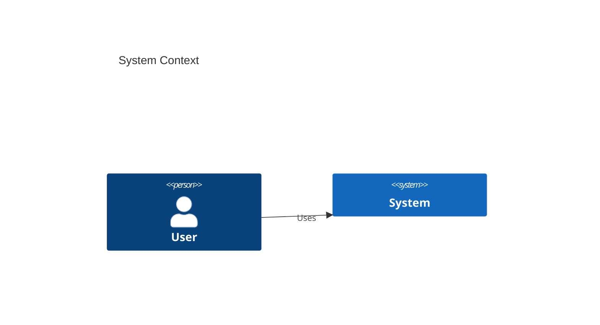

```mv-view
{"id":"mmd_class","kind":"mermaid-class","title":"mermaid-class","modelRefs":["sql_demo#person"],"payload":""}
```
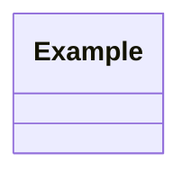

```mv-view
{"id":"mmd_er","kind":"mermaid-er","title":"mermaid-er","modelRefs":["sql_demo#person"],"payload":""}
```
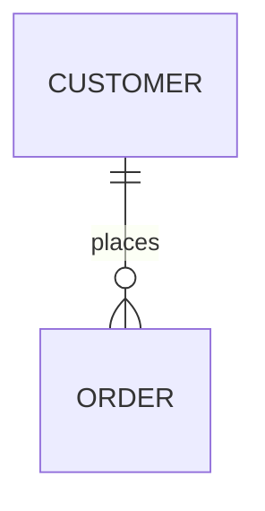

```mv-view
{"id":"mmd_flow","kind":"mermaid-flowchart","title":"mermaid-flowchart","modelRefs":["sql_demo#person"],"payload":""}
```
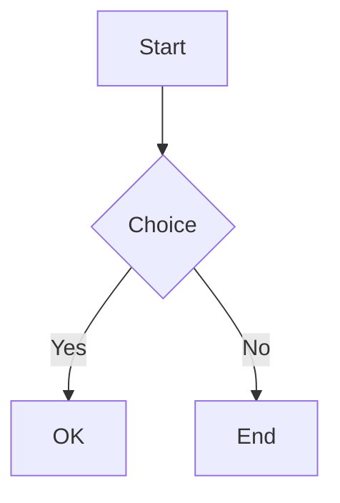

```mv-view
{"id":"mmd_gantt","kind":"mermaid-gantt","title":"mermaid-gantt","modelRefs":["sql_demo#person"],"payload":""}
```
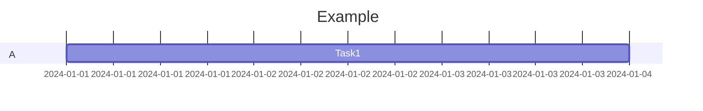

```mv-view
{"id":"mmd_git","kind":"mermaid-gitgraph","title":"mermaid-gitgraph","modelRefs":["sql_demo#person"],"payload":""}
```
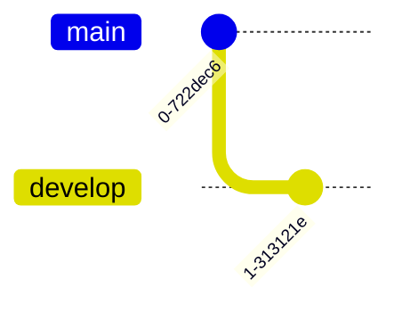

```mv-view
{"id":"mmd_journey","kind":"mermaid-journey","title":"mermaid-journey","modelRefs":["sql_demo#person"],"payload":""}
```
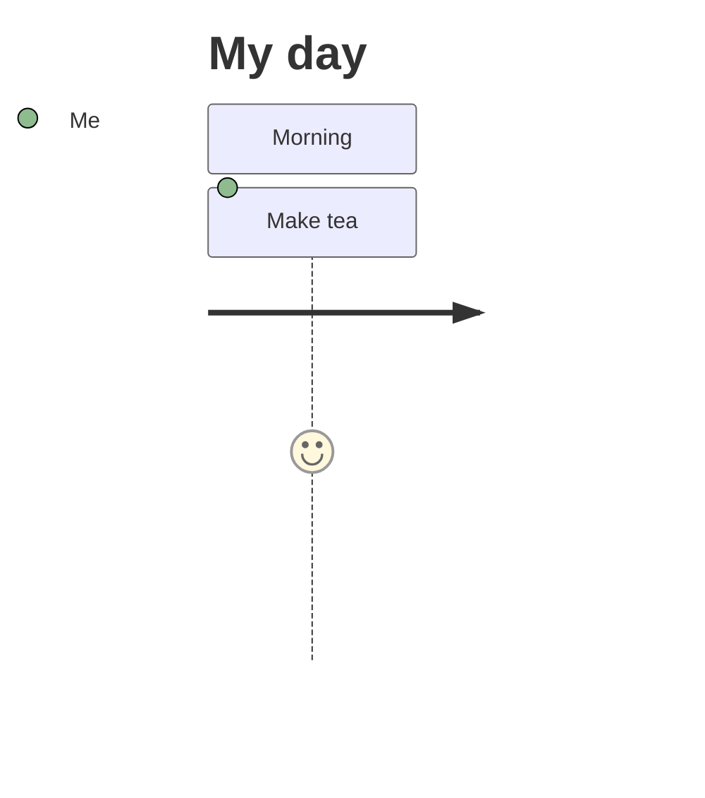

```mv-view
{"id":"mmd_kanban","kind":"mermaid-kanban","title":"mermaid-kanban","modelRefs":["sql_demo#person"],"payload":""}
```
```mermaid
kanban
  Todo
    [Task A]
    [Task B]
  Done[]
```

```mv-view
{"id":"mmd_mindmap","kind":"mermaid-mindmap","title":"mermaid-mindmap","modelRefs":["sql_demo#person"],"payload":""}
```
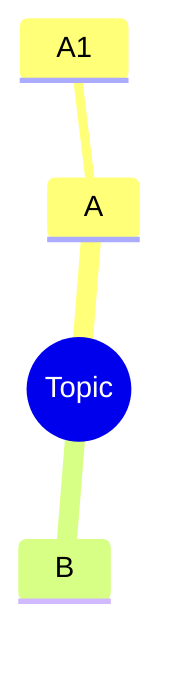

```mv-view
{"id":"mmd_packet","kind":"mermaid-packet","title":"mermaid-packet","modelRefs":["sql_demo#person"],"payload":""}
```
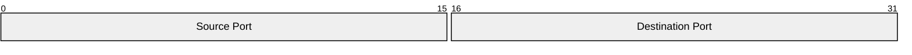

```mv-view
{"id":"mmd_pie","kind":"mermaid-pie","title":"mermaid-pie","modelRefs":["sql_demo#person"],"payload":""}
```
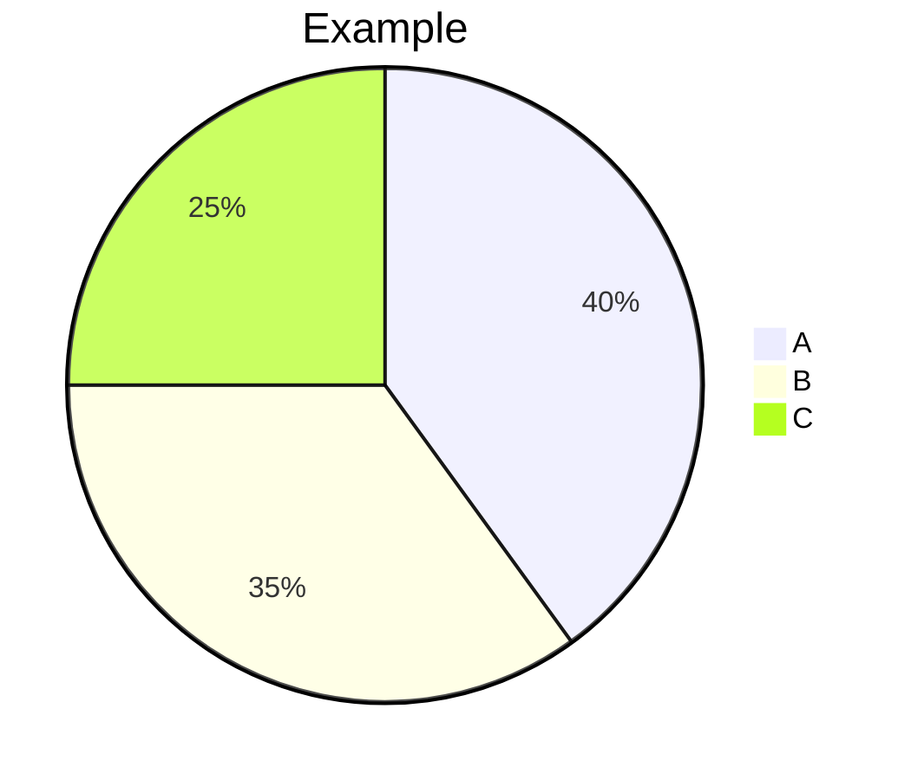

```mv-view
{"id":"mmd_quad","kind":"mermaid-quadrant","title":"mermaid-quadrant","modelRefs":["sql_demo#person"],"payload":""}
```
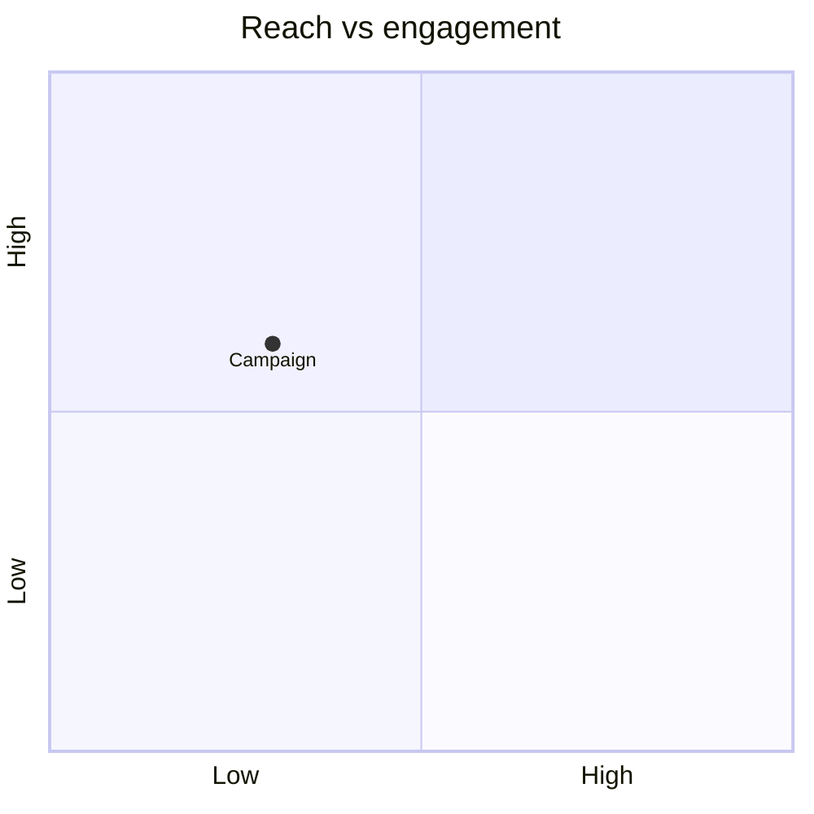

```mv-view
{"id":"mmd_req","kind":"mermaid-requirement","title":"mermaid-requirement","modelRefs":["sql_demo#person"],"payload":""}
```
```mermaid
requirementDiagram
    requirement req1 {
    id: 1
    text: requirement text
    risk: high
    verifymethod: test
    }
    element e1 {
    type: simulation
    }
    e1 - satisfies -> req1
```

```mv-view
{"id":"mmd_sankey","kind":"mermaid-sankey","title":"mermaid-sankey","modelRefs":["sql_demo#person"],"payload":""}
```
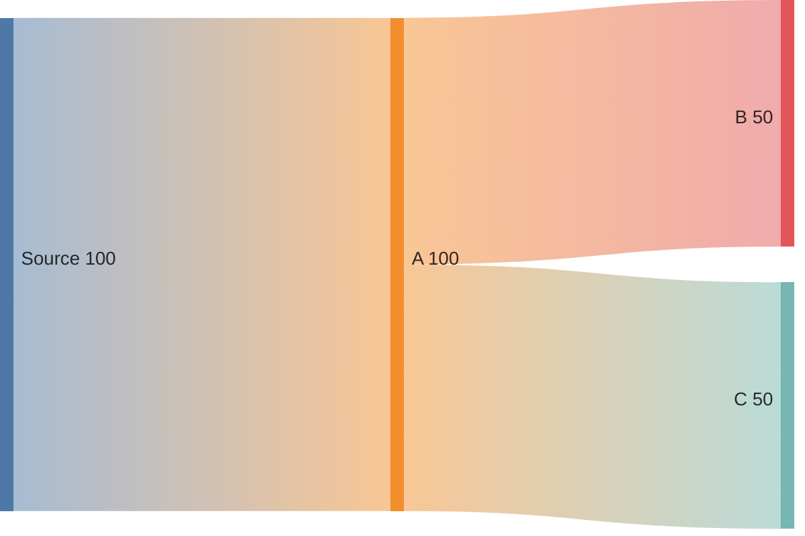

```mv-view
{"id":"mmd_seq","kind":"mermaid-sequence","title":"mermaid-sequence","modelRefs":["sql_demo#person"],"payload":""}
```
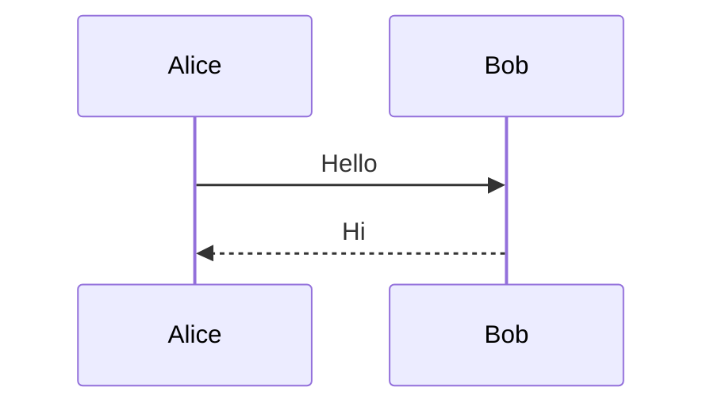

```mv-view
{"id":"mmd_state","kind":"mermaid-state","title":"mermaid-state","modelRefs":["sql_demo#person"],"payload":""}
```
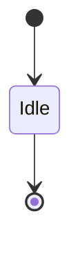

```mv-view
{"id":"mmd_time","kind":"mermaid-timeline","title":"mermaid-timeline","modelRefs":["sql_demo#person"],"payload":""}
```
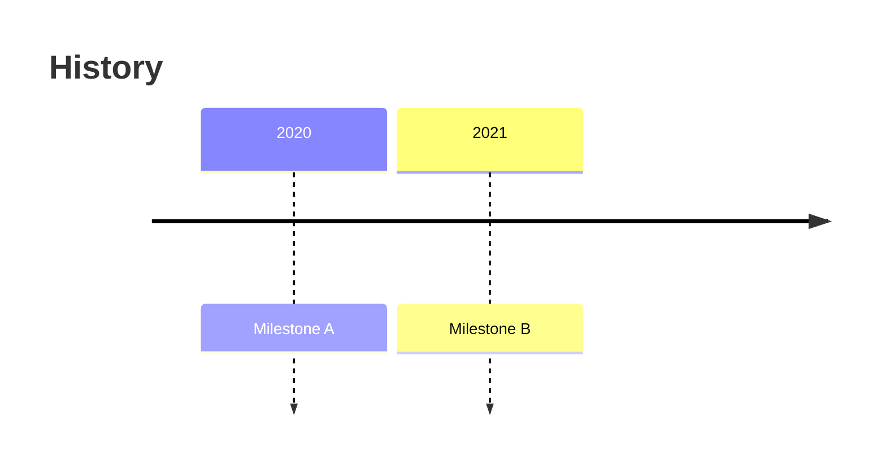

```mv-view
{"id":"mmd_xy","kind":"mermaid-xychart","title":"mermaid-xychart","modelRefs":["sql_demo#person"],"payload":""}
```
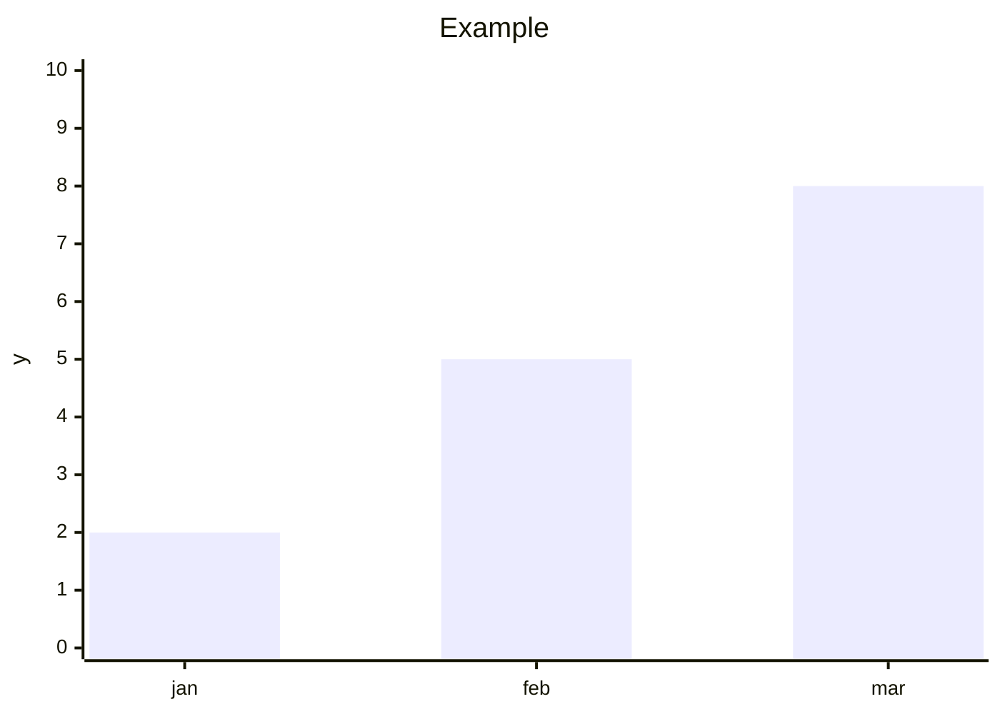

```mv-view
{"id":"mmd_zen","kind":"mermaid-zenuml","title":"mermaid-zenuml","modelRefs":["sql_demo#person"],"payload":""}
```
```mermaid
zenuml
    Alice->Bob: Hello
```
