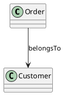
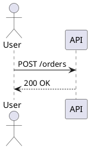
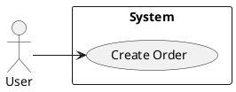

# startuml 扩展示例（插件层）

本文件仅用于 `@startuml` 语法片段示例，作为扩展/插件能力演示。

统一规则见：[`PAYLOAD_RULES.md`](PAYLOAD_RULES.md)。

注意：

- 该语法不属于 `mv-*` 核心 JSON 契约。
- 核心能力示例请看 `models-core.md`。

## class

## sequence

## usecase

