# 示例：Workbench 解析围栏一览（`MvFenceKind`）

## 两种「代码段」不要混为一谈

1. **顶层解析围栏（`MvFenceKind`，共 7 种）**  
   解析器只认下面七种围栏语言；**本文件已为每一种各给至少一块**最小可解析示例，等于 **7/7 已罗列**。在「代码块大纲」里可逐一点开对应画布。

2. **`mv-view` 内的视图子类型（`kind` / `MV_VIEW_KINDS`）**  
   其中 **`mermaid-*` 共 21 种**：在下方 **`mv-model-*` 示例之后** 为 **每一种各写一对** `` ```mv-view `` + `` ```mermaid ``。JSON 里 **`payload` 置空字符串**，Mermaid 正文**只写在紧随的** `` ```mermaid `` 段；解析器会把镜像正文**填入**内存中的 `payload`（与 Workbench 保存行为一致）。示例正文与 `@mvwb/core` 的 `MV_VIEW_KIND_METADATA.payloadPlaceholder` 对齐，便于对照。非 Mermaid 的 `kind` 仍只各举一例（见下一节表与文末围栏）。

- **`` ```mv-model-sql ``**：一组 **SQL 风格子表**（`tables[]`）；下面块 `sql_demo` 含 `person` 与 `order` 两张子表。
- **`` ```mv-view ``**：`kind` 须为 `MV_VIEW_KINDS` 之一。**每个 `mermaid-*`** 在源码中须为 **`` ```mv-view `` + `` ```mermaid ``** 两段（契约见仓库内 `ai-software-engineering/02-physical/md-mv-core/spec.md`）。
- **`` ```mermaid ``**：仅作 **`mermaid-*` 的 `mv-view` 的镜像段**，**不是**与上述七种并列的第八种解析围栏。
- **更复杂的 codespace**：另见上级目录 [`codespace-demo/`](../codespace-demo/)。

## 非 `mermaid-*` 的 `mv-view.kind`（本文件仅示例、非穷尽）

| `kind` | 说明 |
|--------|------|
| `mindmap-ui` | 应用脑图 JSON（见下方围栏） |
| `uml-diagram` | 通用 PlantUML |
| `uml-class` / `uml-sequence` / `uml-activity` | PlantUML 专用画布 |
| `ui-design` | UI 规格画布 |

```mv-model-sql
{
  "id": "sql_demo",
  "title": "演示 SQL Model 组",
  "tables": [
    {
      "id": "person",
      "title": "人员表",
      "columns": [
        { "name": "id", "type": "string" },
        { "name": "name", "type": "string" }
      ],
      "rows": [
        { "id": "p1", "name": "Alice" },
        { "id": "p2", "name": "Bob" }
      ]
    },
    {
      "id": "order",
      "title": "订单表",
      "columns": [
        { "name": "orderId", "type": "string" },
        { "name": "personId", "type": "string" },
        { "name": "amount", "type": "number" }
      ],
      "rows": [
        { "orderId": "o1", "personId": "p1", "amount": 100 },
        { "orderId": "o2", "personId": "p2", "amount": 200 }
      ]
    }
  ]
}
```

```mv-model-kv
{
  "id": "kv_demo",
  "title": "KV 文档集（示例）",
  "documents": [
    { "_id": "doc1", "title": "一条文档", "tags": ["demo"] }
  ]
}
```

```mv-model-struct
{
  "id": "struct_demo",
  "title": "层次结构（示例）",
  "root": {
    "name": "/",
    "attributes": { "format": "mv-model-struct v1" },
    "groups": [
      {
        "name": "run0",
        "datasets": [{ "name": "values", "dtype": "float64", "data": [1, 2, 3] }]
      }
    ]
  }
}
```

```mv-model-codespace
{
  "id": "cs_sample",
  "title": "代码空间（极简）",
  "workspaceRoot": ".",
  "modules": [
    {
      "id": "mod_core",
      "name": "CoreLib",
      "path": "packages/core",
      "role": "lib",
      "namespaces": [
        {
          "id": "ns_root",
          "name": "RootNs",
          "classes": [
            {
              "id": "cls_placeholder",
              "name": "Placeholder",
              "kind": "class",
              "members": []
            }
          ]
        }
      ]
    }
  ]
}
```

```mv-model-interface
{
  "id": "iface_demo",
  "title": "接口模型（示例）",
  "endpoints": [
    { "id": "health", "name": "健康检查", "method": "GET", "path": "/health", "notes": "存活探针" }
  ]
}
```

## 全部 `mermaid-*`（21 种，各一对 `` ```mv-view `` + `` ```mermaid ``）

```mv-view
{
  "id": "mmd_architecture",
  "kind": "mermaid-architecture",
  "title": "mermaid-architecture",
  "modelRefs": [
    "sql_demo#person"
  ],
  "payload": ""
}
```

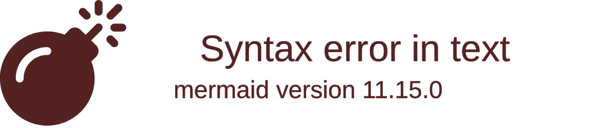

```mv-view
{
  "id": "mmd_block",
  "kind": "mermaid-block",
  "title": "mermaid-block",
  "modelRefs": [
    "sql_demo#person"
  ],
  "payload": ""
}
```

```mermaid
block-beta
columns 1
  block:a["Block A"]
```

```mv-view
{
  "id": "mmd_c4",
  "kind": "mermaid-c4",
  "title": "mermaid-c4",
  "modelRefs": [
    "sql_demo#person"
  ],
  "payload": ""
}
```

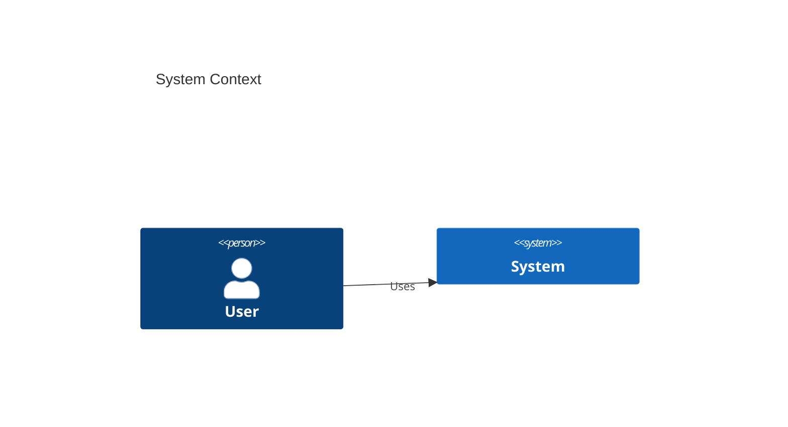

```mv-view
{
  "id": "mmd_class",
  "kind": "mermaid-class",
  "title": "mermaid-class",
  "modelRefs": [
    "sql_demo#person"
  ],
  "payload": ""
}
```

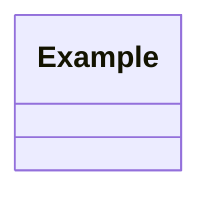

```mv-view
{
  "id": "mmd_er",
  "kind": "mermaid-er",
  "title": "mermaid-er",
  "modelRefs": [
    "sql_demo#person"
  ],
  "payload": ""
}
```

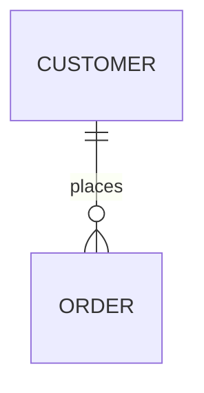

```mv-view
{
  "id": "mmd_flow",
  "kind": "mermaid-flowchart",
  "title": "mermaid-flowchart",
  "modelRefs": [
    "sql_demo#person"
  ],
  "payload": ""
}
```

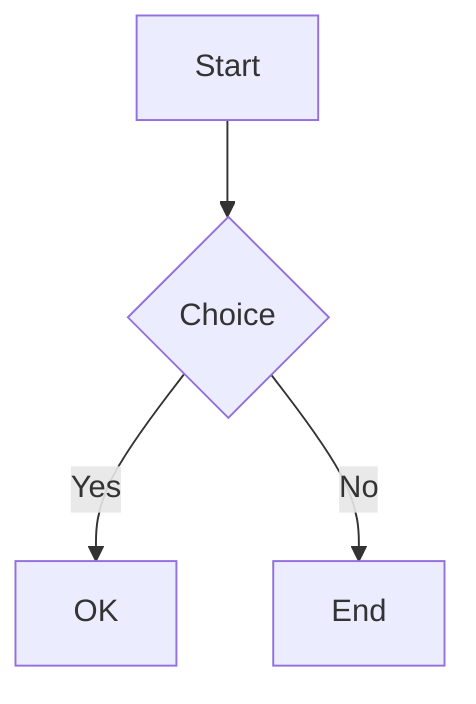

```mv-view
{
  "id": "mmd_gantt",
  "kind": "mermaid-gantt",
  "title": "mermaid-gantt",
  "modelRefs": [
    "sql_demo#person"
  ],
  "payload": ""
}
```

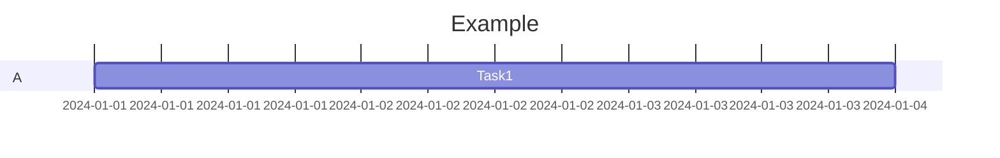

```mv-view
{
  "id": "mmd_git",
  "kind": "mermaid-gitgraph",
  "title": "mermaid-gitgraph",
  "modelRefs": [
    "sql_demo#person"
  ],
  "payload": ""
}
```

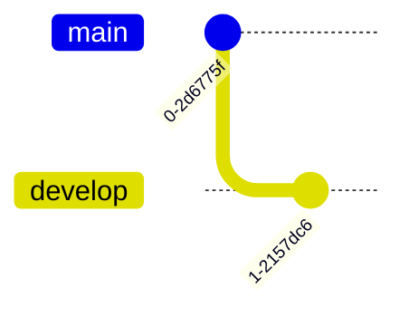

```mv-view
{
  "id": "mmd_journey",
  "kind": "mermaid-journey",
  "title": "mermaid-journey",
  "modelRefs": [
    "sql_demo#person"
  ],
  "payload": ""
}
```

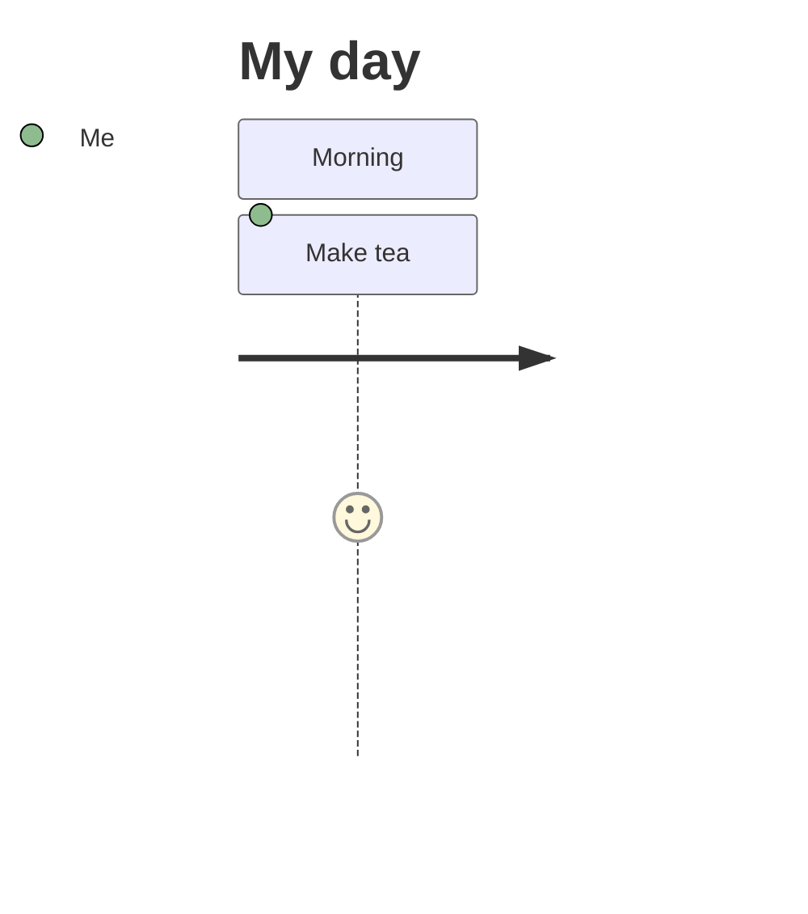

```mv-view
{
  "id": "mmd_kanban",
  "kind": "mermaid-kanban",
  "title": "mermaid-kanban",
  "modelRefs": [
    "sql_demo#person"
  ],
  "payload": ""
}
```

```mermaid
kanban
  Todo
    [Task A]
    [Task B]
  Done[]
```

```mv-view
{
  "id": "mmd_mindmap",
  "kind": "mermaid-mindmap",
  "title": "mermaid-mindmap",
  "modelRefs": [
    "sql_demo#person"
  ],
  "payload": ""
}
```

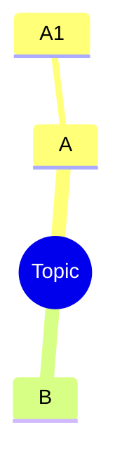

```mv-view
{
  "id": "mmd_packet",
  "kind": "mermaid-packet",
  "title": "mermaid-packet",
  "modelRefs": [
    "sql_demo#person"
  ],
  "payload": ""
}
```

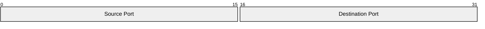

```mv-view
{
  "id": "mmd_pie",
  "kind": "mermaid-pie",
  "title": "mermaid-pie",
  "modelRefs": [
    "sql_demo#person"
  ],
  "payload": ""
}
```

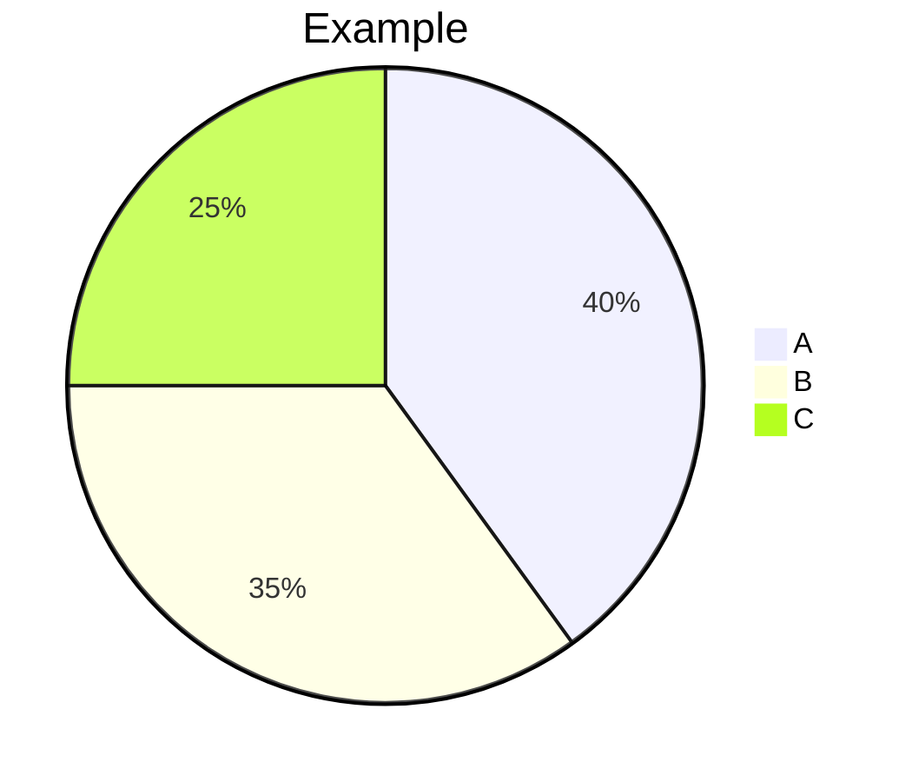

```mv-view
{
  "id": "mmd_quad",
  "kind": "mermaid-quadrant",
  "title": "mermaid-quadrant",
  "modelRefs": [
    "sql_demo#person"
  ],
  "payload": ""
}
```

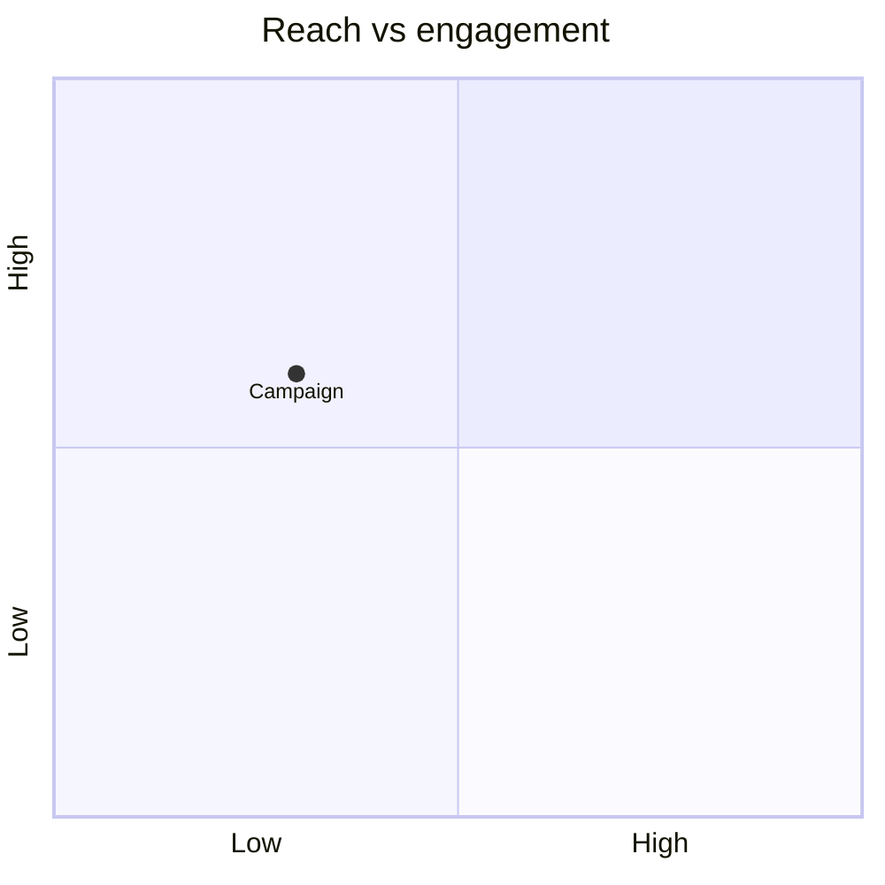

```mv-view
{
  "id": "mmd_req",
  "kind": "mermaid-requirement",
  "title": "mermaid-requirement",
  "modelRefs": [
    "sql_demo#person"
  ],
  "payload": ""
}
```

```mermaid
requirementDiagram
    requirement req1 {
    id: 1
    text: requirement text
    risk: high
    verifymethod: test
    }
    element e1 {
    type: simulation
    }
    e1 - satisfies -> req1
```

```mv-view
{
  "id": "mmd_sankey",
  "kind": "mermaid-sankey",
  "title": "mermaid-sankey",
  "modelRefs": [
    "sql_demo#person"
  ],
  "payload": ""
}
```

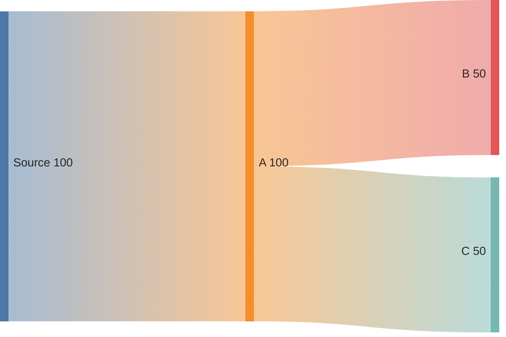

```mv-view
{
  "id": "mmd_seq",
  "kind": "mermaid-sequence",
  "title": "mermaid-sequence",
  "modelRefs": [
    "sql_demo#person"
  ],
  "payload": ""
}
```

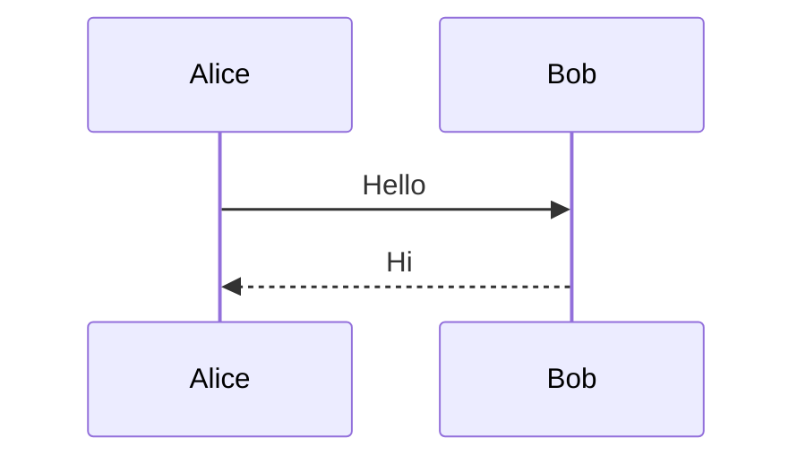

```mv-view
{
  "id": "mmd_state",
  "kind": "mermaid-state",
  "title": "mermaid-state",
  "modelRefs": [
    "sql_demo#person"
  ],
  "payload": ""
}
```

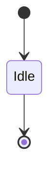

```mv-view
{
  "id": "mmd_time",
  "kind": "mermaid-timeline",
  "title": "mermaid-timeline",
  "modelRefs": [
    "sql_demo#person"
  ],
  "payload": ""
}
```

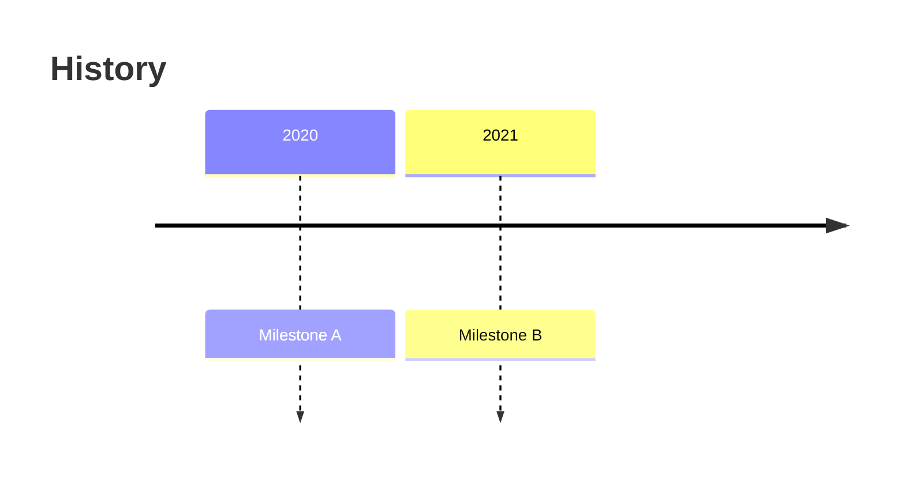

```mv-view
{
  "id": "mmd_xy",
  "kind": "mermaid-xychart",
  "title": "mermaid-xychart",
  "modelRefs": [
    "sql_demo#person"
  ],
  "payload": ""
}
```

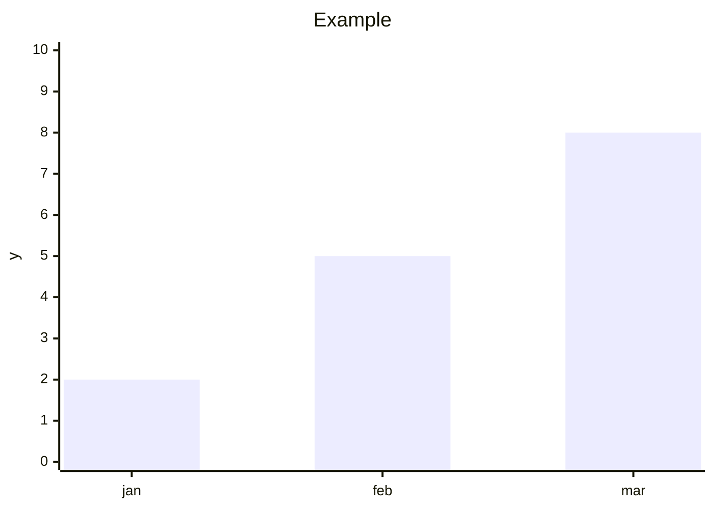

```mv-view
{
  "id": "mmd_zen",
  "kind": "mermaid-zenuml",
  "title": "mermaid-zenuml",
  "modelRefs": [
    "sql_demo#person"
  ],
  "payload": ""
}
```

```mermaid
zenuml
    Alice->Bob: Hello
```

## 其他 `mv-view`（非 Mermaid）

```mv-view
{
  "id": "person_mindmap",
  "kind": "mindmap-ui",
  "title": "关系脑图（示例）",
  "modelRefs": ["sql_demo#person"],
  "payload": "{\"format\":\"mv-mindmap-v0\",\"nodes\":[{\"id\":\"root\",\"label\":\"人员\"}]}"
}
```

```mv-view
{
  "id": "order_uml",
  "kind": "uml-diagram",
  "title": "订单领域（示例）",
  "modelRefs": ["sql_demo#order"],
  "payload": "@startuml\nentity order\n@enduml"
}
```

```mv-view
{
  "id": "order_class_puml",
  "kind": "uml-class",
  "title": "订单类图（专用画布）",
  "modelRefs": ["sql_demo#order"],
  "payload": "@startuml\nclass Order {\n  +String orderId\n}\n@enduml"
}
```

```mv-view
{
  "id": "seq_checkout",
  "kind": "uml-sequence",
  "title": "下单序列（示例）",
  "modelRefs": ["sql_demo#person"],
  "payload": "@startuml\nparticipant User\nparticipant API\nUser -> API: POST /orders\n@enduml"
}
```

```mv-view
{
  "id": "act_review",
  "kind": "uml-activity",
  "title": "评审活动图（示例）",
  "modelRefs": ["sql_demo#person"],
  "payload": "@startuml\nstart\n:起草;\n:评审;\nstop\n@enduml"
}
```

```mv-view
{
  "id": "ui_screen_board",
  "kind": "ui-design",
  "title": "列表页线框",
  "modelRefs": ["sql_demo#person"],
  "payload": "{ \"screens\": [ { \"id\": \"list\", \"title\": \"订单列表\" } ] }"
}
```

```mv-map
{
  "id": "to_ts",
  "rules": [
    { "modelId": "sql_demo#person", "targetPath": "src/models/person.ts", "template": "interface" }
  ]
}
```
